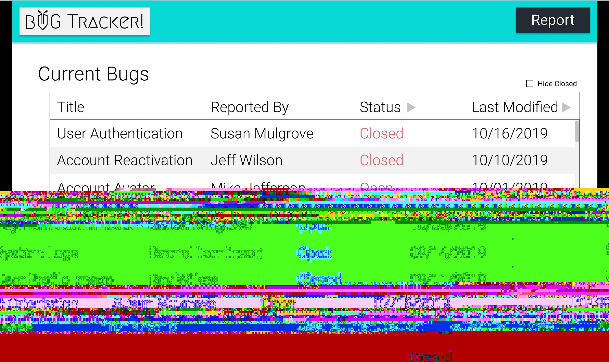
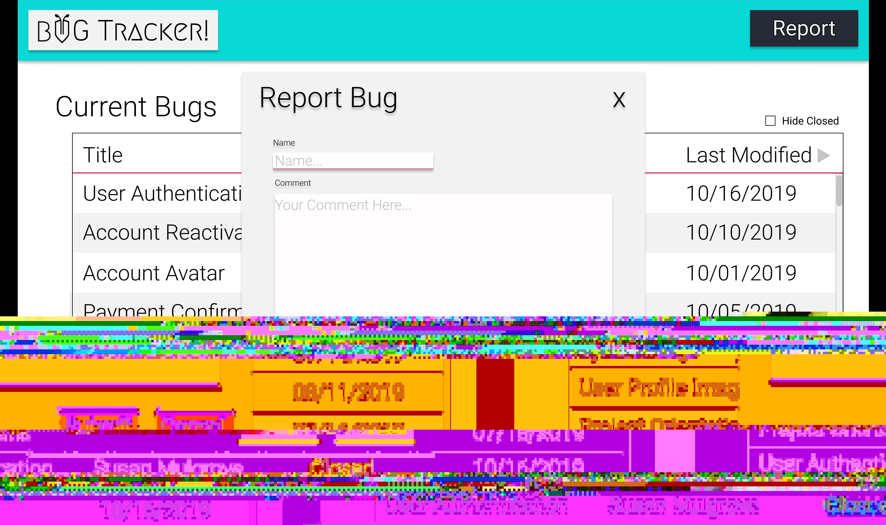
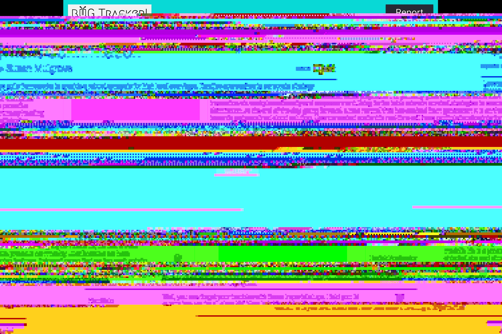
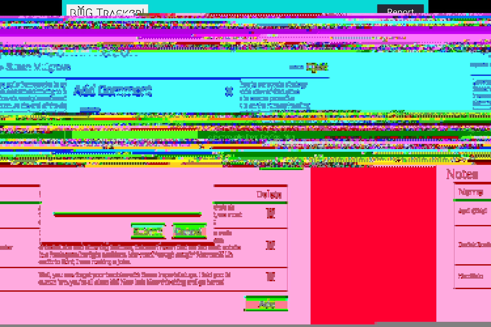

https://buggin-boone.herokuapp.com/#/
# Bug-Report

Welcome to the Bug-Report!

All bugs will have a title, description, who reported the bug, closedDate and whether or not it has been closed.

Users can also add notes to the bug report providing detailed steps towards the bugs resolution.

Once a bug has been closed, no further editing is allowed.


<hr>

### Home View:

<div>
  
</div>
<div>
  
</div>

From the Home page users can view all the bugs that have been added, striked-through for those that are closed (by status). You should are able to filter bugs by their status
<br>
<br>

<hr>

### Details View:

<div>
  
</div>
<div>
  
</div>

The details view provides some additional information about the bug, as well as showing all the notes made by other users. Here notes can be created or removed.


<hr>
<br>
<br>

## Bug-Report API

### Bug Schema

```Javascript
var bug = new Schema({
    closed: { type: Boolean, required: true, default: false },
    description: { type: String, required: true },
    title: { type: String, required: true },
    closedDate: { type: Date}
    creatorEmail: { type: String, required: true }
}, { timestamps: true, toJSON: { virtuals: true } })
```

### Note Schema

```Javascript
var note = new Schema({
    content: { type: String, required: true },
    bug: { type: ObjectId, ref: 'Bug' required: true },
    flagged: { type: String, enum: ["pending", "completed", "rejected"] }
    creatorEmail: { type: String, required: true }
}, { timestamps: true, toJSON: { virtuals: true } })
```

<hr>

> baseUrl: `'https://localhost:3000/api'`

Get

`/bugs`: returns a list of all the bugs

`/bugs/:id`: returns a single bug with all it's data

`/bugs/:id/notes`: returns all notes for a given bug id

Post

`/bugs`: Creates a new bug

`/notes`: Adds a new note to the bug.

Put

> _both of these can only be done if bug is open_

`/bugs/:id`: Edits bug

`/notes/:id`: Edits note. (not required)

Delete

> There is no true bug delete, only changing the status of a bug to closed.

`/bugs/:id`: Changes status of bug from open to close

`notes/:id`: Deletes note.

